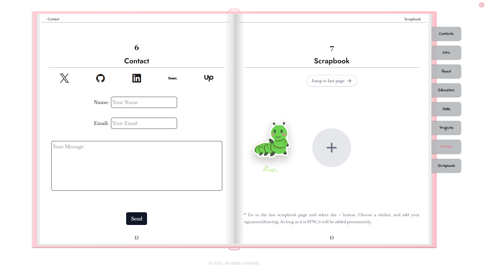
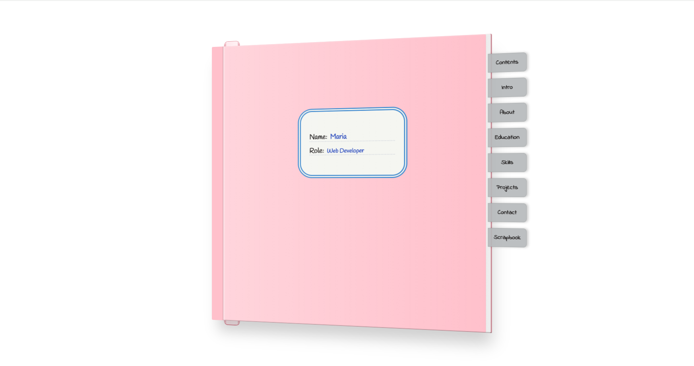
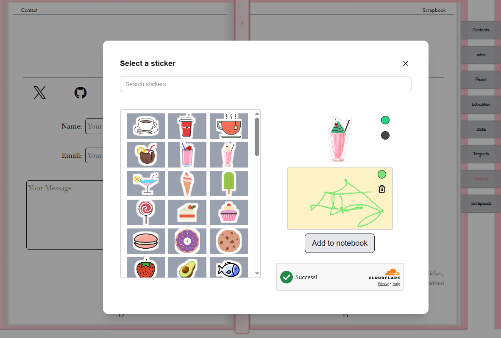
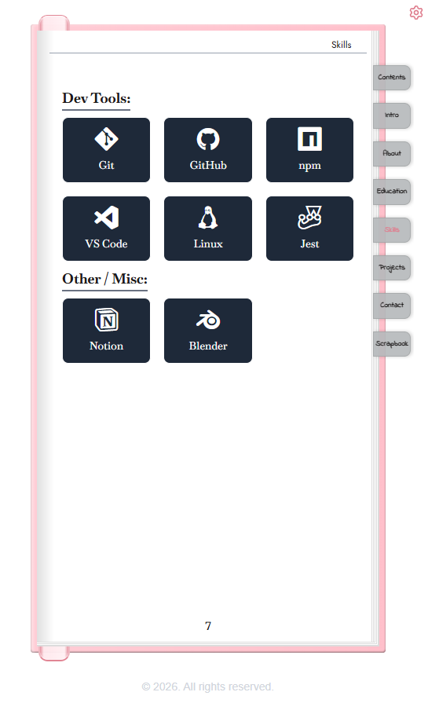

# Personal Portfolio

> An interactive, notebook-style portfolio built with Next.js, React, TypeScript, and Tailwind CSS.

  <a href="https://felina-portfolio.vercel.app">
    <strong>View Live Portfolio →</strong>
  </a>

   

---

## About

This portfolio was designed around a **notebook and scrapbook aesthetic**, with interactive features.

The project took a significant amount of time and experimentation to build, involving a number of technical challenges, design decisions, and compromises along the way.

The goal was to create something that feels personal and unconventional while still demonstrating practical engineering skills.
  

---

## Features

### Interactive Notebook

- Dynamic, page-based navigation
- Two-page desktop layout
- Single-page mobile layout
- Section bookmarks
- Drag-and-drop bookmark
- Dynamic page numbering

### Interactive Scrapbook

- Visitors can leave a sticker from a selection
- Sticker colors can be customized
- Visitors can add a signature or drawing alongside their sticker
 

  

### Persistent Drawings

- Visitors can draw directly on notebook pages
- Drawing data is stored locally using IndexedDB
- Drawings persist between sessions
- Dynamic cursor colors based on the selected drawing color
- Multiple drawing tools:
  - Pencil
  - Pen
  - Highlighter
  - Eraser

### Responsive Design

- Two-page notebook layout on desktop
- Single-page experience on mobile
- Responsive layouts and typography
- Interface behavior adapted to different screen sizes

  

### Navigation

- URL changes based on the current notebook page
- Page state is preserved across reloads
- The notebook opens on the current bookmark when a visitor has previously selected one

### User Options

- Dark and light themes
- Animation toggle
- Sound effects toggle

### Contact

- Contact form
- Server-side API handling

### Admin

- Protected administrative interface
- Message approval and rejection
- Supabase-backed message management

### Performance and Analytics

- Vercel Analytics
- Vercel Speed Insights

### SEO and Social Sharing

- Metadata configuration
- Sitemap
- Robots configuration
- Open Graph image
- Social sharing metadata

### Security

- Rate limiting
- Cloudflare Turnstile
- Protected routes
- Honeypot protection

---

## Tech Stack

| Technology |
| --- |
| **Next.js** |
| **React** |
| **TypeScript** |
| **Tailwind CSS** |
| **Framer Motion** |
| **Supabase** |
| **IndexedDB** |
| **Vercel** |

---

## Planned features/Improvements

The notebook is an ongoing project, and new features may be added as the project evolves.

Some features and improvements I would like to explore include:

- Dynamic screen calculations for individual pages, allowing the notebook to dynamically determine the required number of pages instead of allowing content to overflow
- Improved drawing alignment so drawings remain accurately aligned with notebook content across different screen sizes
- A custom note option allowing visitors to leave a written message in addition to a sticker
- Automatic page navigation
- A mini-games and puzzles section
- Support for multiple languages

---

## License

Copyright © 2026. All rights reserved.

The source code is publicly available for viewing and reference purposes only.
